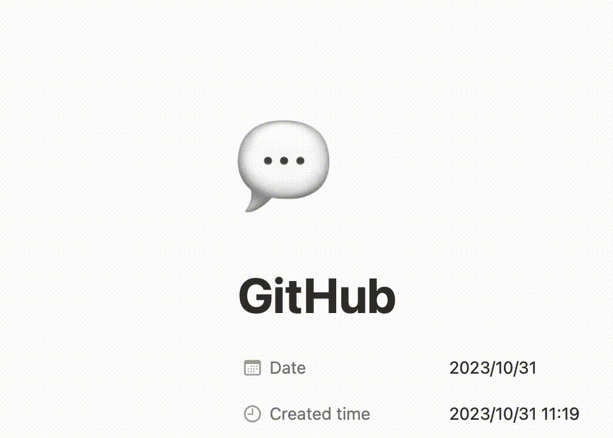

# Logos



## Usage

- Should be lowercase:

  ```
  https://logos.hphk.io/{type}/{name}.{jpg|png}
  ```

  - Example:

    ```
    https://logos.hphk.io/f/hphk.png
    ```

- If you want to download:

  ```bash
  curl https://logos.hphk.io/s/python.jpg --output output.jpg
  ```


## List

- Sorted by name, ascending

| Name | (S)quare | (F)it to content | (P)adding with content | SVG |
| ---- | ---- | ---- | ---- | ---- |
| codespaces | [png](s/codespaces.png) | | | |
| coupang | [jpg](s/coupang.jpg) | | | |
| flex | [png](s/flex.png) | | | |
| github | [jpg](s/python.jpg) | | | |
| go-mascot | [png](s/go-mascot.png) | [png](f/go-mascot.png) | | |
| google-analytics | [png](s/google-analytics.png) | | | |
| jira-software | [jpg](s/jira-software.jpg) [png](s/jira-software.png) | [png](f/jira-software.png) | | |
| k-digital | [jpg](s/k-digital.jpg) | | | |
| notion | [jpg](s/notion.jpg) | | | |
| hphk | [jpg](s/hphk.jpg) | [png](f/hphk.png) | [jpg](p/hphk.jpg) [png](p/hphk.png) |  |
| hphk-h | [jpg](s/hphk-h.jpg) | | | |
| poetry | | | | [svg](svg/poetry.svg) |
| python | [jpg](s/python.jpg) | [png](f/python.png) | | |
| slack | [jpg](s/slack.jpg) | | | |
| youtube | [jpg](s/youtube.jpg) | | | |


## Contribution

- 이미지 해상도의 제한은 없지만, 너무 낮아 확인이 힘들지 않도록 가로 또는 세로가 200px을 넘도록 해주세요.
- jpg는 배경 색상(#fff)이 존재하도록, png는 배경이 없도록 해주세요.
- 각 타입은 다음과 같습니다.
  - `Square`, `s`: 가로, 세로가 같은 이미지
  - `Fit to Content`, `f`: 상하좌우에 여백이 없는 이미지
  - `Padding with content`, `p`: 자유로운 비율의 상하좌우 여백이 있는 이미지
